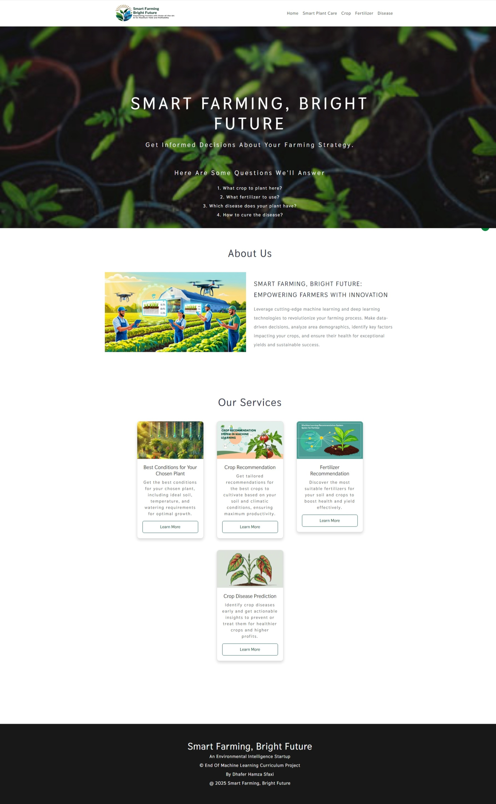
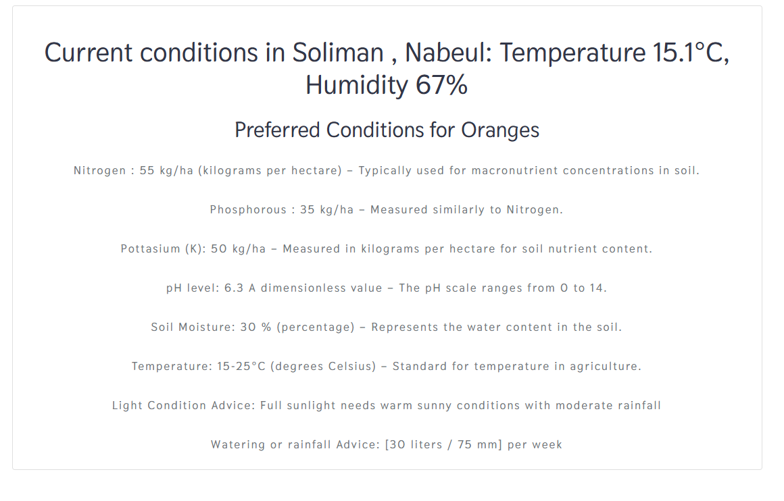
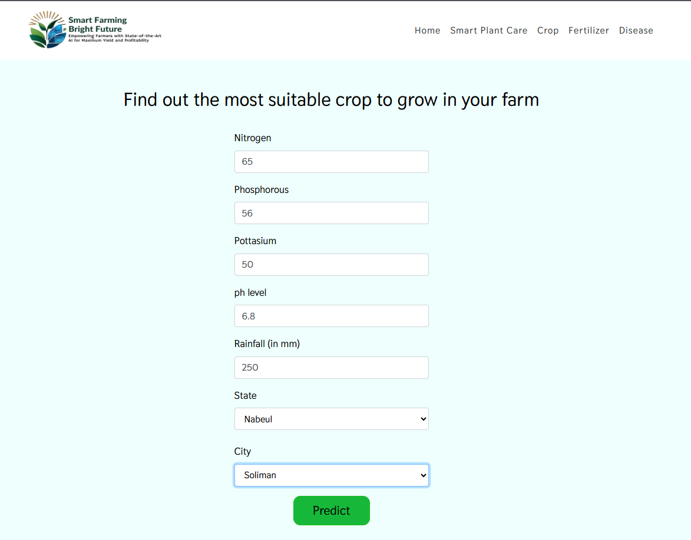
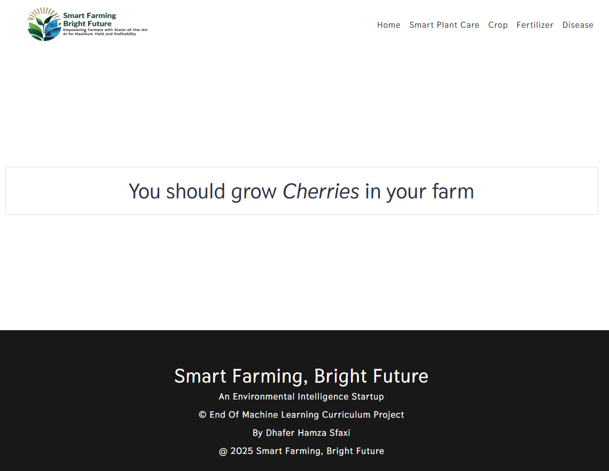
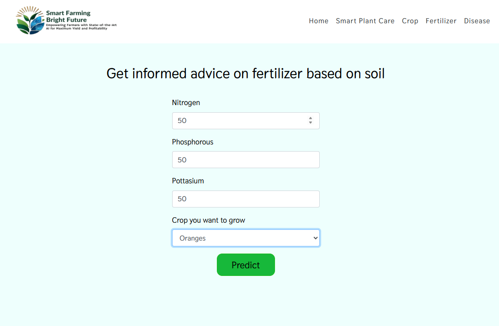
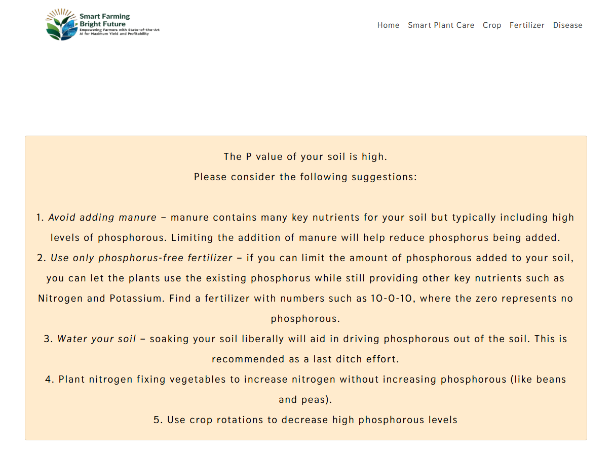
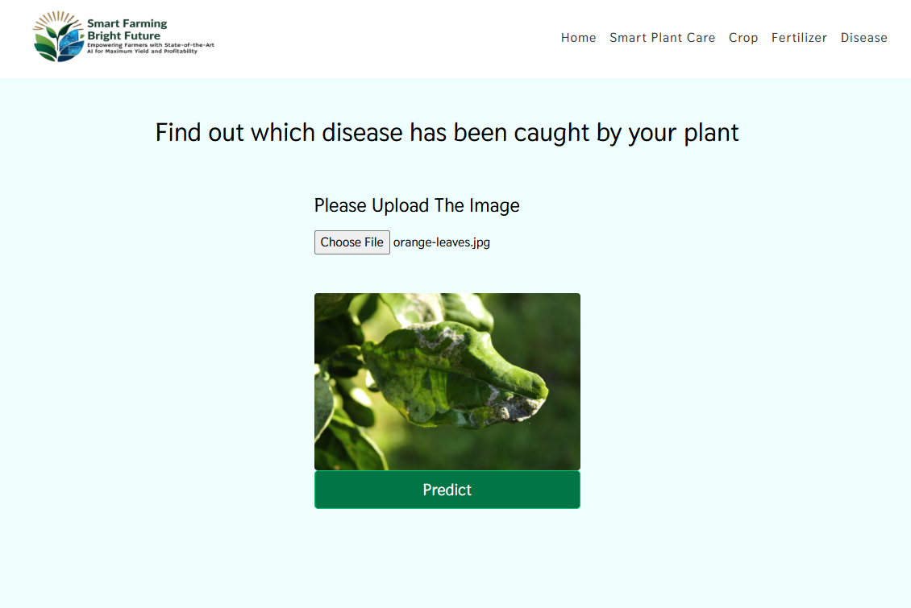
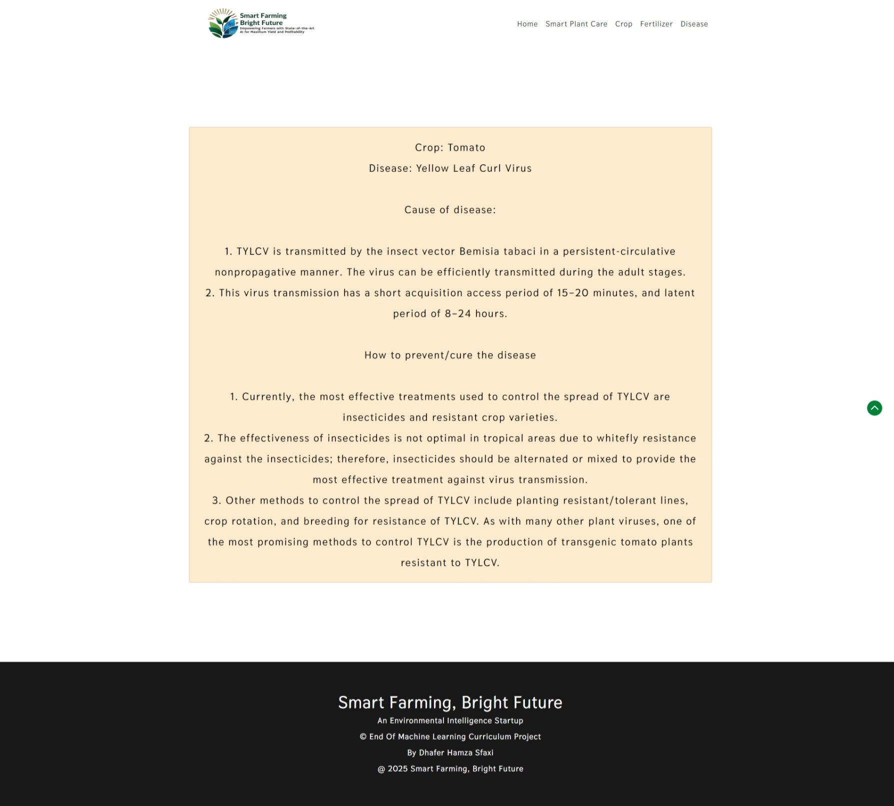

# Smart Farming, Bright Future
#### An Environmental Intelligence Startup

## End Of Machine Learning Curriculum Project 
By Dhafer Hamza Sfaxi
@ 2025 Smart Farming, Bright Future

## MOTIVATION 
- Farming is one of the major sectors that influences a country’s economic growth. 

- In countries like India, the majority of the population is dependent on agriculture for their livelihood. Many new technologies, such as Machine Learning and Deep Learning, are being implemented into agriculture so that it is easier for farmers to grow and maximize their yield. 

- In this project, I present a website in which the following applications are implemented: Crop recommendation, Fertilizer recommendation, and Plant disease prediction, respectively. 

  - In the crop recommendation application, the user can provide the soil data from their side and the application will predict which crop the user should grow. 
  
  - For the fertilizer recommendation application, the user can input the soil data and the type of crop they are growing, and the application will predict what the soil lacks or has excess of and will recommend improvements. 
  
  - For the plant disease prediction application, the user can input an image of a diseased plant leaf, and the application will predict what disease it is and will also give a little background about the disease and suggestions to cure it.

## DATA SOURCE 📊
- [Best Conditions for Your Chosen Plant](https://github.com/dhafer-H-S/GreenThumb/blob/main/Data-processed/recommendation.csv) (custom built dataset)
- [Crop dataset ](https://github.com/dhafer-H-S/GreenThumb/blob/main/Data-processed/crop_recommendation.csv) (custom built dataset)
- [Fertilizer dataset](https://github.com/dhafer-H-S/GreenThumb/blob/main/Data-processed/fertilizer.csv) (custom built dataset)
- [Disease detection dataset](https://www.kaggle.com/vipoooool/new-plant-diseases-dataset)


### Technologies Used
1. **Programming Languages:**
  - Python

2. **Libraries and Frameworks:**
  - **Machine Learning and Deep Learning:**
    - PyTorch
    - torchvision
    - scikit-learn

  - **Data Manipulation and Analysis:**
    - pandas
    - numpy
  - **Visualization:**
    - matplotlib
    - seaborn
  - **Web Framework:**
    - Flask
  - **Utilities:**
    - pickle (for saving models)
    - PIL (Python Imaging Library)

3. **Tools:**
  - Jupyter Notebook
  - Conda (for managing environments)

### Machine Learning Models
1. **Plant Disease Detection Model:**
  - **Model Architecture:** ResNet-9
  - **Libraries Used:** PyTorch, torchvision
  - **Dataset:** Images of healthy and diseased plant leaves

2. **Crop Recommendation Model:**
  - **Models Used:**
    - Decision Tree
    - Random Forest
    - Naive Bayes
    - Support Vector Machine (SVM)

  - **Libraries Used:** scikit-learn
  - **Dataset:** Crop recommendation data (CSV files)

3. **Fertilizer Recommendation Model:**
  - **Models Used:** Not explicitly mentioned, but likely similar to the crop recommendation model
  - **Libraries Used:** scikit-learn
  - **Dataset:** Fertilizer recommendation data (CSV files)


### Notebooks and Scripts
1. **notebooks/plant-disease-classification-resnet-99-2-checkpoint.ipynb:**
  - **Technologies Used:** PyTorch, torchvision, matplotlib
  - **Models Used:** ResNet-9
  - **Functions and Utilities:**
    - Data loading and preprocessing
    - Model training and evaluation
    - Visualization of training progress

2. **notebooks/plant-disease-resnet.ipynb:**
  - **Technologies Used:** PyTorch, torchvision, matplotlib
  - **Models Used:** ResNet
  - **Functions and Utilities:**
    - Data loading and preprocessing
    - Model training and evaluation
    - Visualization of training progress

3. **models/Crop_Recommendation_Model.ipynb:**
  - **Technologies Used:** scikit-learn, matplotlib, seaborn, pandas, numpy
  - **Models Used:** Decision Tree, Random Forest, Naive Bayes, SVM
  - **Functions and Utilities:**
    - Data loading and preprocessing
    - Model training and evaluation
    - Cross-validation
    - Model saving using pickle

### Summary
This project leverages a variety of technologies and tools to build machine learning models for plant disease detection, crop recommendation, and fertilizer recommendation. The primary technologies used include Python, PyTorch, scikit-learn, and Flask. The project is organized into directories for data, models, notebooks, and the web application, with detailed documentation and scripts for data processing, model training, and evaluation.


## How to run locally 🛠️
- Before the following steps make sure you have [git](https://git-scm.com/download), [Anaconda](https://www.anaconda.com/) or [miniconda](https://docs.conda.io/en/latest/miniconda.html) installed on your system
  ```
  ❯ git clone https://github.com/dhafer-H-S/GreenThumb
  ```

- Once the project is cloned, open anaconda prompt in the directory where the project was cloned and paste the following block
  ```
  conda create -n GreenThumb python=3.6.12
  python --version
  output should be => Python 3.6.12 :: Anaconda, Inc.
  conda activate GreenThumb
  pip install -r requirements.txt
  ```
- And finally run the project with
  ```
  python app.py
  ```
- Open the localhost URL provided after running `python app/app.py` and now you can use the project locally in your web browser.


## How to use 💻
- Smart Plant Care Recommendations :
Our system also provides special treatment recommendations tailored to the crop you choose and your specific location (city and state). By analyzing key parameters such as soil nutrients (N-P-K ratios), pH levels, soil moisture, temperature, and light conditions, the system offers precise advice to help you achieve the best results. For example, if you choose to grow almonds in a particular city, the system will recommend the optimal nutrient requirements (N: 45, P: 20, K: 35), ideal pH level (6.5), soil moisture (25%), temperature range (15-30°C), light conditions (full sunlight, prefers long hot summers and well-drained soil), and preferred watering schedule (20 liters / 50 mm per week). This personalized guidance ensures that your crops receive the best possible care based on your local conditions.

- Crop Recommendation System: 
Input the nutrient values of your soil, along with your state and city. Ensure that the N-P-K (Nitrogen-Phosphorous-Potassium) values are entered as their respective ratios. For more details, refer to [this article](https://medium.com/@dhaferhamzasfaxi1/crop-recommendation-system-leveraging-data-for-smarter-farming-b804374d2856). Note: When entering the city name, use commonly known cities. Remote locations may not be supported by the [Weather API](https://www.weatherapi.com/) used to fetch humidity and temperature data.

- Fertilizer suggestion system :
 Enter the nutrient contents of your soil and the crop you want to grow. The algorithm will tell which nutrient the soil has excess of or lacks. Accordingly, it will give suggestions for buying fertilizers. For more details, refer to [this article](https://medium.com/@dhaferhamzasfaxi1/fertilizer-suggestion-system-enhancing-soil-health-for-better-crop-yields-8b81a2803e1a).

- Disease Detection System:
Upload an image of the leaf of your plant. The algorithm will tell the crop type and whether it is diseased or healthy. If it is diseased, it will tell you the cause of the disease and suggest how to prevent/cure the disease accordingly. For more details, refer to [this article](https://medium.com/@dhaferhamzasfaxi1/disease-detection-system-for-tunisian-crops-e74aaa553ce0).
Note that, for now it only supports the following crops:

<details>
  <summary>Supported crops</summary>

Almonds
Anise
Apples
Apricots
Artichokes
Asparagus
Avocados
Badian
Barley
Beans
Beans green
Berries nes
Broad Beans
Cabbages and other brassicas
Carobs
Carrots and turnips
Cauliflowers and broccoli
Cereals
Cereals nes
Cherries
Chick peas
Chillies
Clementines
Cranberries
Cucumbers and gherkins
Dates
Eggplants (aubergines)
Fennel
Fibre Crops Primary
Figs
Fruit Primary
Garlic
Grapefruit
Grapes
Hazelnuts
Horse beans
Kiwi fruit
Leguminous
Lemons
Lentils
Lettuce and chicory
Limes
Linseed
Mandarins
Melons
Mushrooms and truffles
Nuts nes
Oats
Oilcrops
Olives
Onions
Oranges
Papayas
Peaches and nectarines
Pears
Peas
Pistachios
Plums and sloes
Potatoes
Pulses
Pulses nes
Pumpkins
Pyrethrum
Quinces
Rapeseed
Roots
Roots and tubers nes
Satsumas
Seed cotton
Sorghum
Spices nes
Spinach
Strawberries
Sugar Crops Primary
Sugar beet
Sunflower seed
Tangerines
Tobacco
Tomatoes
Treenuts
Triticale
Tubers
Vegetables
Vegetables Primary
Vetches
Watermelons
Wheat
tropical Fruit

</details>


## DEMO
- ### Smart Farming, Bright Future Home page

- ### Smart Plant Care recommendation system


- ### Crop recommendation system




- ### Fertilizer suggestion system




- ### Disease Detection system



## Usage ⚙️  

**GreenThumb** is designed to help **farmers, gardeners, and plant enthusiasts** optimize growing conditions for their chosen plants. By leveraging **machine learning and data-driven insights**, this project provides recommendations on the best environment for various crops based on factors like location, climate, and plant-specific needs.  

### 🌱 How It Helps  
- **For Farmers** 👨‍🌾: It helps maximize **crop yield** by providing the best environmental conditions, disease detection, and insights on soil suitability.  
- **For Gardeners** 🏡: It assists in **choosing the right plants** for a given location and provides guidance on **optimal care**.  
- **For Researchers & Developers** 💻: It serves as a **foundation for further improvements**, enabling contributions like adding new datasets, fine-tuning models, and improving predictions.  

### 🔍 Future Enhancements  
- **Expanding the Dataset** 📊: More **local crop data** from Tunisia can be added via **web scraping** or direct contributions.  
- **Model Fine-Tuning** 🎯: The machine learning models can be improved by **training on region-specific crops** for **higher accuracy**.  
- **Integration of Weather APIs** 🌤️: Real-time weather data can help refine recommendations.  
- **Better Frontend & UX** 🎨: Improving the user interface will make the platform **easier to use for non-technical users**.  

By contributing to **GreenThumb**, you help **empower the agricultural community** with smarter farming solutions! 🚀🌾

