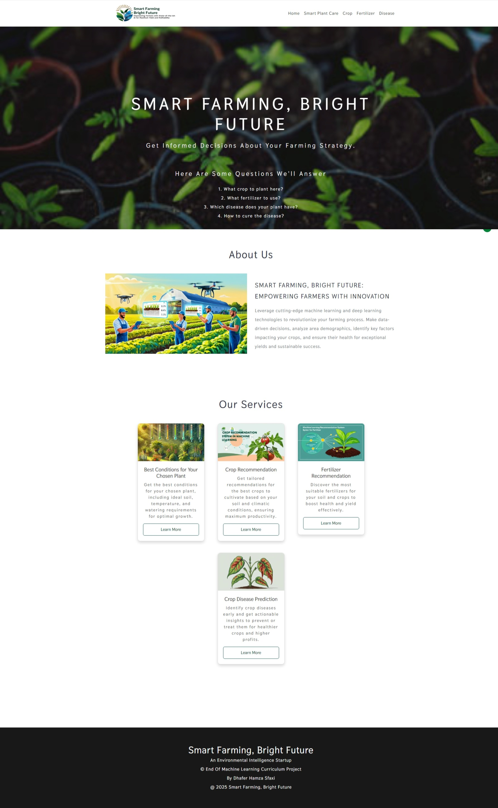
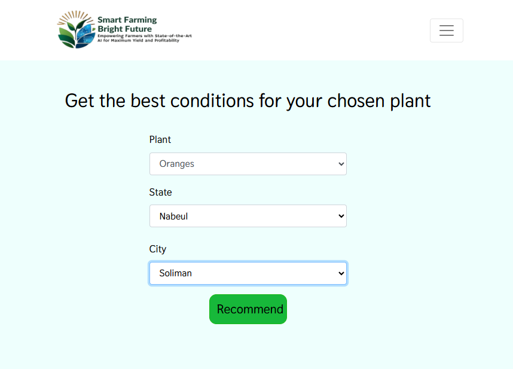
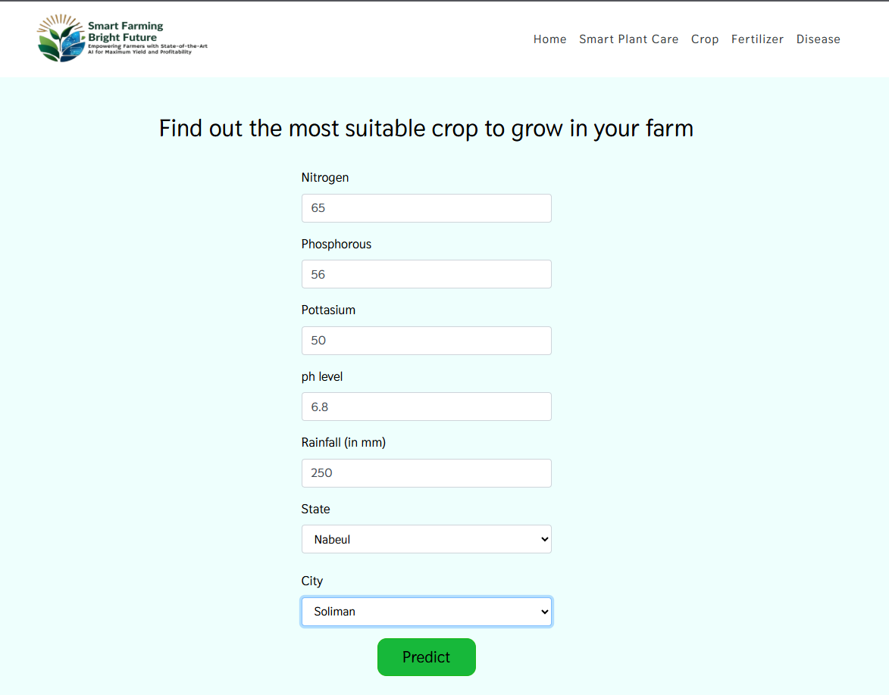
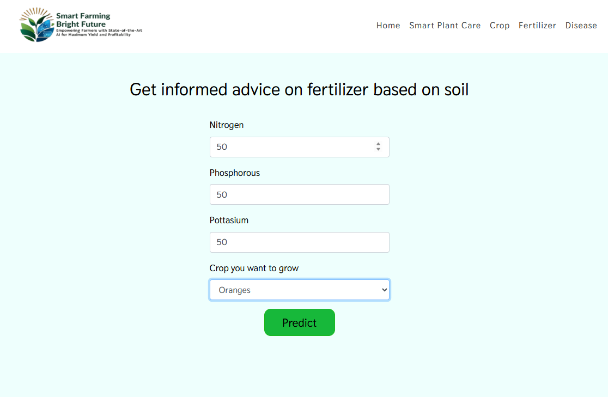
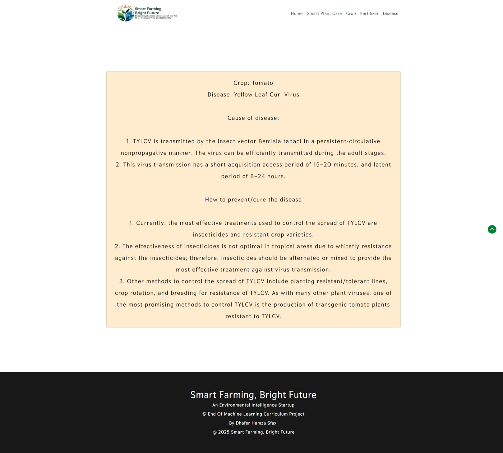

# Smart Farming, Bright Future
#### An Environmental Intelligence Startup

## End Of Machine Learning Curriculum Project 
By Dhafer Hamza Sfaxi
@ 2025 Smart Farming, Bright Future

---

## Slide 1: Introduction
### Smart Farming, Bright Future
- An Environmental Intelligence Startup
- End Of Machine Learning Curriculum Project 
- By Dhafer Hamza Sfaxi

---

## Slide 2: Motivation
### Why Smart Farming?
- Farming is crucial for economic growth.
- In countries like India, agriculture is a major livelihood.
- New technologies like Machine Learning and Deep Learning are enhancing agriculture.

---

## Slide 3: Project Overview
### Applications Implemented
1. **Crop Recommendation**
    - Predicts the best crop based on soil data.
2. **Fertilizer Recommendation**
    - Suggests improvements based on soil and crop data.
3. **Plant Disease Prediction**
    - Identifies plant diseases from leaf images.

---

## Slide 4: Data Sources
### Datasets Used
- [Best Conditions for Your Chosen Plant](https://github.com/dhafer-H-S/GreenThumb/blob/main/Data-processed/recommendation.csv)
- [Crop dataset](https://github.com/dhafer-H-S/GreenThumb/blob/main/Data-processed/crop_recommendation.csv)
- [Fertilizer dataset](https://github.com/dhafer-H-S/GreenThumb/blob/main/Data-processed/fertilizer.csv)
- [Disease detection dataset](https://www.kaggle.com/vipoooool/new-plant-diseases-dataset)

---

## Slide 5: Technologies Used
### Programming Languages
- Python

### Libraries and Frameworks
- **Machine Learning:** PyTorch, torchvision, scikit-learn
- **Data Analysis:** pandas, numpy
- **Visualization:** matplotlib, seaborn
- **Web Framework:** Flask
- **Utilities:** pickle, PIL

---

## Slide 6: Machine Learning Models
### Models Implemented
1. **Plant Disease Detection**
    - **Architecture:** ResNet-9
    - **Libraries:** PyTorch, torchvision
2. **Crop Recommendation**
    - **Models:** Decision Tree, Random Forest, Naive Bayes, SVM
    - **Libraries:** scikit-learn
3. **Fertilizer Recommendation**
    - **Libraries:** scikit-learn

---

## Slide 7: Notebooks and Scripts
### Key Notebooks
1. **Plant Disease Classification**
    - **File:** `notebooks/Crop-disease-classification_resnet-9.ipynb`
    - **Technologies:** PyTorch, torchvision, matplotlib
2. **Crop Recommendation Model**
    - **File:** `models/Crop_Recommendation_Model.ipynb`
    - **Technologies:** scikit-learn, matplotlib, seaborn, pandas, numpy

---

## Slide 8: Summary
### Project Summary
- Utilizes Python, PyTorch, scikit-learn, and Flask.
- Organized into directories for data, models, notebooks, and web application.
- Detailed documentation and scripts for data processing, model training, and evaluation.

---

## Slide 9: How to Run Locally
### Steps to Run
1. Clone the repository:
    ```bash
    git clone https://github.com/dhafer-H-S/GreenThumb
    ```
2. Create and activate a conda environment:
    ```bash
    conda create -n GreenThumb python=3.6.12
    conda activate GreenThumb
    pip install -r requirements.txt
    ```
3. Run the project:
    ```bash
    python app.py
    ```
4. Open the provided localhost URL in your web browser.

---

## Slide 10: How to Use
### Features
- **Smart Plant Care Recommendations:** Personalized guidance based on local conditions.
- **Crop Recommendation System:** Input soil nutrient values and location.
- **Fertilizer Suggestion System:** Input soil nutrient contents and crop type.
- **Disease Detection System:** Upload an image of a plant leaf.

---

## Slide 11: Demo
### Screenshots
- **Home Page**
  
- **Plant Care Recommendation**
  
  
- **Crop Recommendation**
  
  
- **Fertilizer Suggestion**
  
  
- **Disease Detection**
  
  

---

## Slide 12: Usage
### Who Can Benefit?
- **Farmers:** Maximize crop yield.
- **Gardeners:** Choose the right plants.
- **Researchers & Developers:** Foundation for further improvements.

---

## Slide 13: Future Enhancements
### Potential Improvements
- Expand dataset with local crop data.
- Fine-tune models for higher accuracy.
- Integrate real-time weather data.
- Improve frontend and user experience.

---

## Slide 14: Code Snippets
### Example: Crop Recommendation Model
```python
from sklearn.ensemble import RandomForestClassifier
from sklearn.model_selection import train_test_split
import pandas as pd

# Load dataset
data = pd.read_csv('data/crop_recommendation.csv')

# Preprocess data
X = data.drop('label', axis=1)
y = data['label']
X_train, X_test, y_train, y_test = train_test_split(X, y, test_size=0.2, random_state=42)

# Train model
model = RandomForestClassifier(n_estimators=100, random_state=42)
model.fit(X_train, y_train)

# Evaluate model
accuracy = model.score(X_test, y_test)
print(f'Accuracy: {accuracy * 100:.2f}%')
```

---

## Slide 15: Conclusion
### Empowering Agriculture
- **GreenThumb** leverages machine learning to provide smart farming solutions.
- Contribute to the project and help empower the agricultural community!

---

## Slide 16: Contact
### Get in Touch
- **GitHub:** [dhafer-H-S](https://github.com/dhafer-H-S/GreenThumb)
- **Medium Articles:** [Dhafer Hamza Sfaxi](https://medium.com/@dhaferhamzasfaxi1)

---

```javascript
function createSlides() {
    var presentation = SlidesApp.create('Smart Farming, Bright Future');
    
    var slidesData = [
        {
            title: 'Introduction',
            bullets: [
                'An Environmental Intelligence Startup',
                'End Of Machine Learning Curriculum Project',
                'By Dhafer Hamza Sfaxi'
            ]
        },
        {
            title: 'Motivation',
            bullets: [
                'Farming is crucial for economic growth.',
                'In countries like India, agriculture is a major livelihood.',
                'New technologies like Machine Learning and Deep Learning are enhancing agriculture.'
            ]
        },
        {
            title: 'Project Overview',
            bullets: [
                'Crop Recommendation: Predicts the best crop based on soil data.',
                'Fertilizer Recommendation: Suggests improvements based on soil and crop data.',
                'Plant Disease Prediction: Identifies plant diseases from leaf images.'
            ]
        },
        {
            title: 'Data Sources',
            bullets: [
                'Best Conditions for Your Chosen Plant: https://github.com/dhafer-H-S/GreenThumb/blob/main/Data-processed/recommendation.csv',
                'Crop dataset: https://github.com/dhafer-H-S/GreenThumb/blob/main/Data-processed/crop_recommendation.csv',
                'Fertilizer dataset: https://github.com/dhafer-H-S/GreenThumb/blob/main/Data-processed/fertilizer.csv',
                'Disease detection dataset: https://www.kaggle.com/vipoooool/new-plant-diseases-dataset'
            ]
        },
        {
            title: 'Technologies Used',
            bullets: [
                'Programming Languages: Python',
                'Machine Learning: PyTorch, torchvision, scikit-learn',
                'Data Analysis: pandas, numpy',
                'Visualization: matplotlib, seaborn',
                'Web Framework: Flask',
                'Utilities: pickle, PIL'
            ]
        },
        {
            title: 'Machine Learning Models',
            bullets: [
                'Plant Disease Detection: ResNet-9, PyTorch, torchvision',
                'Crop Recommendation: Decision Tree, Random Forest, Naive Bayes, SVM, scikit-learn',
                'Fertilizer Recommendation: scikit-learn'
            ]
        },
        {
            title: 'Notebooks and Scripts',
            bullets: [
                'Plant Disease Classification: notebooks/Crop-disease-classification_resnet-9.ipynb, PyTorch, torchvision, matplotlib',
                'Crop Recommendation Model: models/Crop_Recommendation_Model.ipynb, scikit-learn, matplotlib, seaborn, pandas, numpy'
            ]
        },
        {
            title: 'Summary',
            bullets: [
                'Utilizes Python, PyTorch, scikit-learn, and Flask.',
                'Organized into directories for data, models, notebooks, and web application.',
                'Detailed documentation and scripts for data processing, model training, and evaluation.'
            ]
        },
        {
            title: 'How to Run Locally',
            bullets: [
                'Clone the repository: git clone https://github.com/dhafer-H-S/GreenThumb',
                'Create and activate a conda environment: conda create -n GreenThumb python=3.6.12, conda activate GreenThumb, pip install -r requirements.txt',
                'Run the project: python app.py',
                'Open the provided localhost URL in your web browser.'
            ]
        },
        {
            title: 'How to Use',
            bullets: [
                'Smart Plant Care Recommendations: Personalized guidance based on local conditions.',
                'Crop Recommendation System: Input soil nutrient values and location.',
                'Fertilizer Suggestion System: Input soil nutrient contents and crop type.',
                'Disease Detection System: Upload an image of a plant leaf.'
            ]
        },
        {
            title: 'Demo',
            bullets: [
                'Home Page: app/static/images/Screenshot_4-2-2025_42352_127.0.0.1.jpeg',
                'Plant Care Recommendation: app/static/images/input-data-rec.png, app/static/images/output-data-rec.png',
                'Crop Recommendation: app/static/images/Crop-recommendation-system.png, app/static/images/Crop-recommendation-system2.png',
                'Fertilizer Suggestion: app/static/images/Fertilizer-suggestion1.png, app/static/images/Fertilizer-suggestion2.png',
                'Disease Detection: app/static/images/Disease-Detection.png, app/static/images/Screenshot_4-2-2025_43215_127.0.0.1.jpeg'
            ]
        },
        {
            title: 'Usage',
            bullets: [
                'Farmers: Maximize crop yield.',
                'Gardeners: Choose the right plants.',
                'Researchers & Developers: Foundation for further improvements.'
            ]
        },
        {
            title: 'Future Enhancements',
            bullets: [
                'Expand dataset with local crop data.',
                'Fine-tune models for higher accuracy.',
                'Integrate real-time weather data.',
                'Improve frontend and user experience.'
            ]
        },
        {
            title: 'Code Snippets',
            bullets: [
                'Example: Crop Recommendation Model',
                'from sklearn.ensemble import RandomForestClassifier',
                'from sklearn.model_selection import train_test_split',
                'import pandas as pd',
                'data = pd.read_csv(\'data/crop_recommendation.csv\')',
                'X = data.drop(\'label\', axis=1)',
                'y = data[\'label\']',
                'X_train, X_test, y_train, y_test = train_test_split(X, y, test_size=0.2, random_state=42)',
                'model = RandomForestClassifier(n_estimators=100, random_state=42)',
                'model.fit(X_train, y_train)',
                'accuracy = model.score(X_test, y_test)',
                'print(f\'Accuracy: {accuracy * 100:.2f}%\')'
            ]
        },
        {
            title: 'Conclusion',
            bullets: [
                'GreenThumb leverages machine learning to provide smart farming solutions.',
                'Contribute to the project and help empower the agricultural community!'
            ]
        },
        {
            title: 'Contact',
            bullets: [
                'GitHub: https://github.com/dhafer-H-S/GreenThumb',
                'Medium Articles: https://medium.com/@dhaferhamzasfaxi1'
            ]
        }
    ];
    
    slidesData.forEach(function(slide) {
        var slideObj = presentation.appendSlide(SlidesApp.PredefinedLayout.TITLE_AND_BODY);
        slideObj.getShapes()[0].getText().setText(slide.title);
        slide.bullets.forEach(function(bullet) {
            slideObj.getShapes()[1].getText().appendParagraph(bullet);
        });
    });
}
```